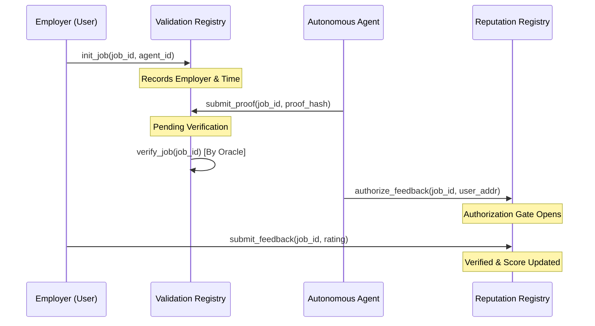

# MX-8004: Trustless Agents Standard (MultiversX)

[](https://opensource.org/licenses/MIT)
[](https://multiversx.com)

**MX-8004** is a protocol standard for building and interacting with **Trustless Agents** on the MultiversX blockchain. It provides a robust, decentralized framework for Agent Identity, Task Validation, and Reputation without relying on centralized intermediaries.

---

## 🏛 Architecture

The MX-8004 standard is composed of three primary registries:

### 1. Identity Registry (NFT-based)
Empowers agents with a verifiable, on-chain identity linked to a unique NFT.
- **Sovereign Metadata**: Linked to decentralized storage (IPFS).
- **Public Key Anchoring**: Each agent identity is tied to an Ed25519 public key for off-chain message signing.

### 2. Validation Registry (Authenticity Layer)
Ensures that work claimed by an agent was actually performed and verified.
- **Job Initialization**: Employers record tasks on-chain before work begins.
- **Storage Cleanup**: Optimized cleanup mechanisms to minimize blockchain footprint.
- **Oracle Verification**: Supports external oracles to confirm task success.

### 3. Reputation Registry (Anti-Gaming Layer)
A high-fidelity scoring system protected against Sybil attacks and frontrunning.
- **Authorization Gates**: Agents must authorize specific clients to leave feedback.
- **Frontrunning Protection**: Only the verifiable employer of a job can submit a rating.
- **Agent Responses**: Agents can provide counter-evidence for specific feedback on-chain.

---

## 🔄 Protocol Flow



---

## 🚀 Getting Started

### Prerequisites
- [Rust](https://www.rust-lang.org/tools/install)
- [multiversx-sc-meta](https://github.com/multiversx/mx-sdk-rs)
- [mxpy](https://docs.multiversx.com/sdk-and-tools/mxpy/installing-mxpy)

### Building the Contracts
```bash
# Build the entire workspace
mxpy contract build identity-registry
mxpy contract build validation-registry
mxpy contract build reputation-registry
```

### Running Tests
The project includes both RustVM unit tests and declarative Scenario tests.
```bash
# Run all tests
cargo test --workspace
```

---

## 🛡 Security & Anti-Gaming

MX-8004 implements several best-of-breed security patterns:
- **Checks-Effects-Interactions**: Followed throughout to prevent reentrancy.
- **Linked Verification**: Feedback scores are invalid unless backed by a `Verified` job in the `ValidationRegistry`.
- **Client Filtering**: High-reputation agents can filter out feedback from non-trusted or non-linked clients.

---

## ⚖️ License
This project is licensed under the MIT License - see the [LICENSE](LICENSE) file for details.
